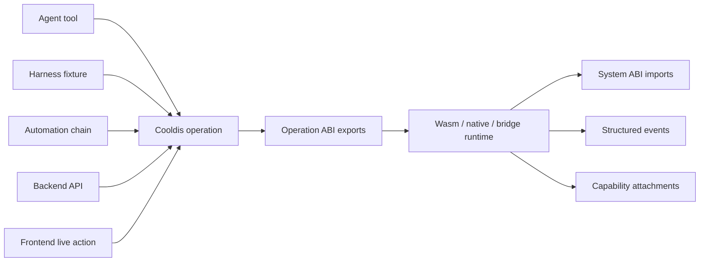
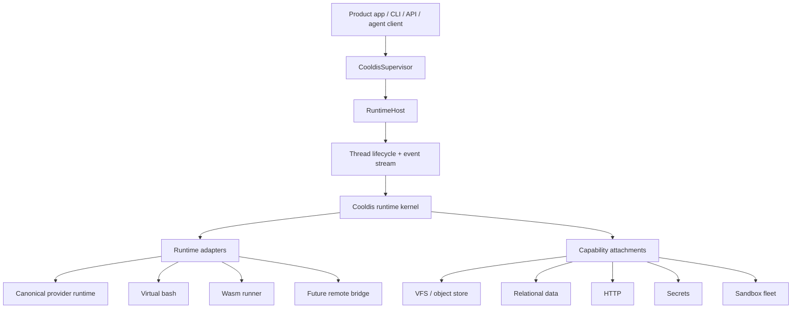

# Cooldis

> Cool Declarative Intelligence Substrate.

> **Status:** Cooldis is highly experimental; APIs and behavior are subject to substantial change, and it is not recommended for production usage yet.

**Cooldis is an open serverless agent platform built on a declarative
intelligence substrate.** Define the agent, not the app around it. Build agents
locally, publish them to managed cloud, install agents like packages, and govern
them like infrastructure without vendor lock-in.

The core product bet is that **an agent is not a prompt; an agent is a runtime
object**. You declare agents, model profiles, tools, resources, grants, context,
placement, and runtime defaults; Cooldis lowers those declarations into governed
execution. You can run *many different* agents inside one infrastructure block
without spawning a Linux container per agent.

That's a different thing from the layers it's usually confused with:

- not an **agent** — Cooldis runs them, it isn't one;
- not an **AI SDK** — it doesn't just wrap model APIs;
- not an **agent SDK** — it isn't a library you bolt into one app;
- not an **orchestration system** — it isn't a graph engine sequencing steps.

It is the platform and substrate *underneath* those shapes: the infrastructure
block where agent declarations become inspected, permissioned, durable runtime
work.

> **New here?** Start with the
> **[docs overview](docs/index.md)** for the public reading path, then try
> **[Getting Started](docs/getting-started.md)** and the
> **[ABI contract](docs/abi.md)** for the concrete runtime boundary.

## Cooldis As Open Serverless Agent Platform

Serverless does not mean "Lambda clone". It means the agent is no longer an app
server every team has to package, deploy, scale, and operate by hand.

The product promise is managed agent infrastructure without vendor lock-in. The
managed cloud should be the easiest production path, while the open substrate and
portable agent definition keep local and alternative runtimes viable.

Cooldis makes the agent itself the deployable unit:

```text
agent declaration
+ capability bindings
+ resources
+ context pipelines
+ hooks and grants
+ placement requirements
-> governed runtime object
```

The user-facing promise is:

```text
Build locally.
Publish to managed cloud.
Install agents like packages.
Govern them like infrastructure.
Keep the definition portable.
```

The repo today is still an experimental runtime-primitives workspace. The
serverless platform is the product direction that those primitives are being
assembled toward.

## Cooldis As Declarative Intelligence Substrate

The substrate is the implementation thesis under the platform category:

```text
Cooldis = Cool Declarative Intelligence Substrate
```

There are two declaration layers:

- **component declarations**: concrete capabilities, manifests, grants, mounts,
  bindings, providers, and surfaces;
- **behavior declarations**: roles, goals, responsibilities, strategies,
  context rules, and skill-like intent.

Both are useful only when the runtime can inspect them before execution and
enforce them during execution. Prose can express intent. Manifests can describe
components. Rust host code turns those declarations into authority-bearing
effects, then records events and receipts.

## Cooldis As Agent Operating System

The cleanest way to picture it: **Cooldis is an operating-system kernel for
agents.** Many tenants run at once, each installs and swaps its own tools without
a restart, every privileged action is requested through explicit, permissioned
syscalls, and the kernel owns lifecycle, scheduling, isolation, and I/O.

Today's agent infrastructure has no kernel — the application *code* is the
runtime. Changing an agent means rebuilding and redeploying the very thing that
runs it. In OS terms that's pre-multiprocessing: every app ships its own OS, no
privilege separation, reboot to change anything.

The mapping is unusually literal:

| Operating system | Cooldis |
| --- | --- |
| kernel | the Cooldis kernel / `CooldisSupervisor` |
| processes | agent threads |
| multi-user | tenants |
| **syscalls** | **system ABI** — guests request HTTP, secrets, VFS, etc. through explicit, capability-gated host imports |
| scheduler | supervisor routing + `RuntimeHost` |
| filesystem | the VFS, with object-store and host mounts |
| `apt install`, no reboot | `cooldis tool publish` → grant; capability appears on the next turn |
| file permissions / capabilities | capability grants and per-tenant envelopes, fail-closed |
| containers | placement: in-sandbox host bash vs out-of-sandbox executor |

The syscall mapping is the part that makes "kernel" more than a metaphor: a guest
asking the host for HTTP or a secret through an explicit, capability-gated import
is exactly a syscall trapping into the kernel. See
[ABI: Cooldis Operation Boundary](docs/abi.md) for the syscall surface.

Two honest bounds on the analogy:

- **Isolation is placement-dependent.** The kernel always mediates *authority*
  (grants, fail-closed). How *hard* the wall is depends on placement: a Wasm
  guest is strongly sandboxed, host-bash-in-sandbox is softer, an external
  executor is hard again. The kernel enforces the capability envelope; placement
  decides the thickness of the wall.
- **It goes beyond a classic OS.** A normal OS lets you install programs. Cooldis
  lets a program author a *new capability* and have the kernel project it as a
  tool, CLI command, HTTP route, or MCP export — closer to an OS where user-space
  can mint new, validated, atomically swappable syscalls. That's the
  [polymorphism layer](#the-deeper-bet-polymorphism) below.

## What It Gives You

- **Many distinct agents in one process.** A multi-tenant supervisor and runtime
  hosts run thousands of agents side by side, each with its own model loop,
  tools, and policy — no container-per-agent tax.
- **Per-agent tool surfaces.** Every agent gets its own configurable toolset and
  permission gates. Two agents in the same host can expose completely different
  capabilities.
- **Hot-swappable capabilities, no recompile.** Tools and operations publish,
  register, and replace atomically at runtime — `cooldis tool publish`, grant it to
  the tenants or threads that should see it, done. A running agent can gain a new
  capability on its next turn without rebuilding a bundle or redeploying a
  server.
- **In-sandbox or out-of-sandbox execution.** Virtual bash and the VFS can run
  inside a sandboxed placement or route whole scripts to an external sandbox /
  remote Linux executor — same contract either way. The public V1 docs keep this
  at the ABI and command-contract boundary until placement docs are promoted.
- **Lifecycle you can trust.** Submit, steer, cancel, checkpoint, resume, fork,
  and structured events are uniform across every agent and every adapter.

The short version: **Cooldis is the easiest way to spin up 1,000 _different_
agents you can install, inspect, grant, run, resume, and eventually publish to
managed placement.**

Product code should configure and call Cooldis. It should not live inside it.

## Contributing

Cooldis is not accepting public contributions yet. Please read
[CONTRIBUTING.md](CONTRIBUTING.md) before opening issues, and do not open
unsolicited pull requests. Report suspected vulnerabilities through the private
process in [SECURITY.md](SECURITY.md).

## License

Cooldis is licensed under the [Apache License, Version 2.0](LICENSE).

## Agent Manifest Release Cut

The agent manifest is intentionally staged. V1 ships a bounded, typed,
fail-closed slice (`schema_version = 1`): `cooldis agent plan`, `publish`,
`list`, and `show` resolve a source manifest and publish an immutable local
record under `.cooldis/agents`, with content-addressed refs resolved at
publish time and `latest` alias records maintained on every publish.
`cooldis agent run` and app-server `thread/start` instantiate a thread from
a published `agent://...` ref (alias or version), with compile and bind
receipts recorded as events on the thread before the first turn. See
[Cooldis Agent CLI](docs/agent-cli.md).

V1 manifest scope (what the schema accepts):

- **identity** — name, namespace, version, publisher metadata, and
  compatibility;
- **model profiles** — an ordered list of provider/model catalog refs; the
  first entry is the default, and V1 binds only the default;
- **tools** — exactly three declaration types: `bash_tool`, `direct_tool`,
  and `protocol_tool_import`;
- **resources** — minimal blob-style resources only;
- **context** — a single default pipeline over the built-in kernel
  assemblers, with explicit budget shares and built-in compaction;
- **policies and grants** — declared authority, required capabilities, and
  fail-closed visibility rules;
- **runtime defaults** — cwd, timeouts, cancellation, streaming, and
  compaction thresholds, with a deny-by-default allowlist for per-start
  overrides.

Deferred — and fail-closed by name, not silently ignored. A V1 manifest
that declares any of these is rejected with an error naming the deferral:

- `couplings`, `views`, `hooks`, `topology`, `io`, and `persistence`
  sections;
- `skills` as resource packages, and `dataset` / `index` resource kinds;
- dynamic model switching among declared profiles;
- guest-provided context assemblers beyond the built-ins.

Unknown keys are rejected everywhere; there is no permissive parsing mode.
Deferral means "not declarable in the V1 schema" — runtime features behind
these names keep working where they already exist.

Harness is not a manifest field. It is the resolved execution envelope produced
from those concrete parts. Cooldis may export or inspect that resolved portable
harness later, but V1 authors should not write `harness = "codex"` or
`harness_ref = ...`.

For tools, the invariant is:

```text
operation contract
-> many lawful surfaces
-> manifest/binding chooses visible surfaces
-> grants authorize invocation
```

Published is not visible. Visible is not granted. Granted is not unobserved.

## The Choice You Shouldn't Have To Make

Survey the landscape and you'll notice almost everything forces a tradeoff along
two axes:

1. **Modifiable agent capabilities** — can an agent's tools change *without*
   rebuilding and redeploying code?
2. **Tenancy and placement** — can many distinct agents share one process, and
   can the same declared capability surface run *inside* a sandbox or *outside*
   against an external one?

Most systems let you have one side of each, not both:

- **Agent SDKs and frameworks** make capabilities flexible *in code*, but the
  unit is one app deployment. Modifying a tool means a rebuild and redeploy, and
  "multi-tenant" really means many deployments.
- **Sandbox-per-agent platforms** give you isolation and multi-tenancy by handing
  every agent its own Linux container — but the capability set is baked into an
  image, placement is fixed, and the next agent costs another container.
- **Local single-runtime tools** are fast and modifiable but single-tenant, with
  the capability surface fixed by the binary you're running.

So you usually pick: *flexible capabilities but single-tenant and unisolated*, or
*isolated and multi-tenant but rigid and heavy*.

Cooldis refuses the tradeoff. Capabilities are runtime data you publish, grant,
and swap without recompiling; many independently-governed agents are co-resident
in one host process; and the same agent contract can resolve against an
in-sandbox placement (host bash + VFS) or an out-of-sandbox placement
(external / remote-Linux executor). You get modifiable capabilities **and**
multi-tenant density **and** configurable sandbox placement at the same time.

## The Story Behind Cooldis

Cooldis started as infrastructure we needed for something else.

We were building [Someone](https://someone.cool), a personal AI companion, and we
wanted *real* personal agents: one per user, each able to grow its own tools and
capabilities over time. Then we went looking for something to run them on — and
there was nothing. The market only offered two shapes, and neither fit:

- **single-tenant agents** — one agent, one process or deployment, you're the
  only user;
- **predefined multi-tenant agents** — many users, but every agent shares one
  fixed, baked-in capability set.

What we actually needed was the third thing: many tenants, each running a
*different* and *evolving* agent, sharing one runtime. The thing an operating
system gives you for programs, but that nothing gave us for agents. So we built
the kernel ourselves and split it out of the product, so the runtime could stay
clean and the product could just call it.

That's why this repo exists. Someone is the product; Cooldis is the runtime
underneath it — and underneath anyone else who hits the same wall.

## The Deeper Bet: Polymorphism

There's a second, longer-horizon reason the runtime is shaped this way. Every
capability in Cooldis is a single computation contract that can take many lawful
forms.

```text
one computation contract
-> many lawful forms
-> safe self-extension
```

The same callable unit runs as an LLM tool, a CLI command, a virtual bash
process, an HTTP route, an MCP export, a test fixture, or a frontend action. The
surface changes. The contract does not.

That's what makes Cooldis not just a place to *run* agents, but a place where
agents can safely **extend themselves** — writing, composing, publishing, and
governing their own capabilities.

Most agent infrastructure is shaped around what today's models *can't* do yet:
planning aids, brittle chains, hardcoded tool glue, prompt routers, context
hacks. Useful now. Increasingly irrelevant as models get stronger.

Cooldis is built around the opposite assumption.

As models get smarter, the bottleneck moves from *"can the model decide what to
do?"* to *"can the system safely absorb what the model learns and turns into new
capability?"* The next hard problem is **trustworthy agent mutation** — and that
is exactly what Cooldis is for.

It makes that mutation **portable, inspectable, reversible, and composable.**
The model is not the structure of the system; it's the adaptive energy inside
it. The runtime provides the engine block — lifecycle, history, contracts,
ports, authority, events, capability grants, publish boundaries, rollback
points. The resolved harness is the envelope that reshapes as the engine runs
under new conditions: repeated work becomes an operation, remembered knowledge
becomes a tool, common judgment becomes policy.

This is the long-horizon design bet behind Cooldis:
**Cooldis is the canonical substrate for robust agent self-improvement.**

## Why Dis Cooldis Cool

Agent systems tend to collapse into one of two bad shapes:

- **product-shaped** runtime code, where auth, billing, dashboards, deployment,
  and execution melt into one tangled service;
- **backend-shaped** runtime code, where one database, shell, provider, or
  sandbox becomes the universe everything else has to fit inside.

Cooldis keeps the kernel small and the seams canonical. Threads run on Cooldis's
own runtime — a provider-neutral model loop, virtual bash, and prebuilt Wasm
artifacts — all behind one `RuntimeHost` lifecycle seam, with a path open for
future remote-bridge placements. (Cooldis borrows the Codex *wire shape* for its
app server so existing clients work; it does not run threads on Codex. More on
that below.)

That symmetry is what makes the system both **portable** and **safe to modify**.
If a system has one-off seams everywhere, self-extension turns into arbitrary
backend mutation. If it has canonical seams, an agent can improve the concrete
manifest parts that form its resolved harness without dissolving the runtime.

The unifying idea is **ABI**: a portable computation contract with lawful
surfaces. Guest programs import explicit host powers through system ABI
calls, export explicit operations through a versioned operation ABI, and Cooldis
re-presents those operations as whatever surface the caller needs.



The one law that makes all of this hold together:

```text
Every surface is faithful, or it is illegal.
```

A surface may rename syntax, transport, framing, or placement. It may **not**
invent new powers, hide durable mutation, erase required inputs, collapse events
into final output, or pretend side effects are ordinary return values. That is
what separates Cooldis from a plugin registry or an agent framework: a plugin
registry names tools, a framework lets a model call them — Cooldis gives
computation a *lawful identity* that survives across tools, processes, APIs,
tests, frontends, and future self-authored extensions.

See [ABI: Cooldis Operation Boundary](docs/abi.md) for the full contract,
host/guest mechanics, and the surface law. The follow-on notes cover the
[provider adapter surface](docs/provider-adapters.md),
[RPC Control Plane and Dev Chat](docs/app-server.md),
[Cooldis daemon](docs/daemon.md),
[OpenAPI adapter](docs/openapi-adapter.md), and the
[command contract surface](docs/command-contracts.md). The repository shape
lives in the [Repository Map](docs/repository-map.md).

## How Dis Cooldis Work

Cooldis has one process-local supervisor and one or more tenant runtime hosts.
The supervisor routes by coordinates; each host owns live threads and delegates
execution to an adapter.



The core Rust layers:

- **`CooldisSupervisor`** — registers tenants and routes operations by
  `tenant_id/user_id/session_id/thread_id`.
- **`RuntimeHost`** — owns live runtime threads for one tenant runtime context.
- **`AgentRuntimeFactory` / `AgentRuntime`** — the adapter seam for the canonical
  provider runtime, virtual bash, Wasm, and future bridge-backed engines. A
  `RuntimeHost` is bound to one factory; the seam is what stays uniform, not the
  individual adapter's execution and result shape.
- **`RuntimeServices`** — the adapter-facing surface for canonical history,
  checkpoints, event emission, and host-owned state.
- **`SessionStore`** — canonical provider-neutral history, backed by in-memory
  and SQLite implementations today.

The supervisor rejects unknown tenants, cross-tenant parent threads,
cross-session parent threads, and coordinate-addressed operations where the
caller supplies the wrong user or session for a thread. Active submit is
steerable input, not a "busy" failure — runtimes can accept pending input and
consume it at their next safe boundary.

## What's Actually Built

The local runtime spine is mostly in place: lifecycle, provider loop, virtual
bash, host workspace authoring, operation registry, and the Wasm operation path
all work today. Concrete surfaces:

- **`CanonicalProviderRuntimeFactory`** — builds model requests from canonical
  history and adapts OpenAI Responses, OpenAI Chat Completions, and Anthropic
  Messages without storing provider-native JSON as the runtime model. Provider
  clients expose queryable capability records, so unsupported tools, streaming,
  reasoning, cache controls, and images fail closed before wire dispatch.
  Provider runtimes can mount kernel tool routers — including the model-visible
  `bash` tool — so a model turn can author files inside a configured host
  workspace without bypassing Cooldis events and tool receipts.
  `LocalOfflineProviderClient` gives a deterministic text-only family for tests.
- **`VirtualBashRuntimeFactory`** — runs Bashkit behind a Cooldis-owned
  execution facade and VFS boundary. Routing policy can stay virtual-only, route
  whole scripts to host bash or a remote Linux executor, or expose named proxy
  builtins such as `cargo` while Bashkit keeps parsing, pipes, substitutions,
  and redirections.
- **`VirtualMount::object_store(...)`** — mounts S3/R2-compatible object-store
  prefixes into the virtual filesystem with managed writeback.
- **`cooldis-mcp-server`** — MCP stdio tools for daemon-backed orchestration:
  start/list/read threads, submit and wait for turns, run one-shot prompts, and
  call `command/exec` through the same control plane as the Codex-compatible
  client. See [Cooldis MCP Server](docs/mcp-server.md).
- **`WasmRuntimeFactory`** — loads prebuilt Wasm artifacts and runs them under
  Cooldis lifecycle policy, via the legacy `handle_turn` ABI or the operation
  ABI with manifest discovery, call-by-id, byte source/sink handles, and an
  event sink.
- **`OperationRegistry`** — the in-memory operation surface for a turn:
  validates Wasm and kernel-native operation manifests, supports atomic
  replacement, invokes named operations, and derives CLI / HTTP / LLM-tool / MCP
  projection records.
- **`CooldisProcessHandle`** — one process/event result surface across virtual
  bash, host bash / remote Linux execution, Wasm operations, and bridge streams:
  stdout, stderr, exit/terminal state, truncation, artifacts, file deltas,
  retained replay, and live event subscription.
- **`LocalOperationRegistry`** + **`OperationBlobStore`** — durable operation
  publication under `.cooldis/operations`: content-addressed artifacts, active
  records, version records, and scoped operation binding snapshots.
- **`LocalPluginCatalog`** + **`HostFileSystem`** — loads durable operation
  records back as agent-visible plugins with shared VFS mounts over a contained
  live host-directory backend.
- **`LocalAgentRegistry`** — durable agent manifest publication under
  `.cooldis/agents`, with `plan` as the dry-run resolution preview and `publish`
  as the immutable record boundary.
- **`CapabilityBridge`** — a scaffold for local daemons, remote workers, sandbox
  fleets, and in-process providers; `unix.exec` is the first namespace under it.
- **`cooldis dev chat` / `cooldis dev rpc` / `cooldis rpc` /
  `cooldis daemon`** — a Codex-compatible CLI, a protocol debug client for a
  running daemon, a WebSocket JSON-RPC app server copying the Codex remote wire
  shape, and a foreground daemon that loads `cooldis.toml` and can print
  launchd/systemd definitions without installing them.
- **Codex compatibility, not a runtime target** — Cooldis is *not* meant to run
  threads on Codex. It borrows the Codex wire shape so existing clients work,
  and keeps `CodexCliRuntimeFactory`, a thin process-backed `codex exec` bridge
  used only as a cheap local validation smoke. Production execution is
  Cooldis's own runtime; the repo does not vendor Codex or wrap Codex's
  in-process thread manager.
- **`crates/cooldis-guest-sdk`** + **`cooldis-sandbox-probe`** — Rust guest-side
  crate for manifests, HTTP envelopes, status codes, and host import wrappers;
  plus a libkrun readiness probe (capability probe only — it does not start a
  microVM).

Two ABI shapes are supported. The legacy Wasm runner ABI is intentionally tiny:

```text
guest exports:
  memory
  handle_turn() -> i32

host imports:
  cooldis.input_len() -> i32
  cooldis.input_read(ptr, max_len) -> copied_len
  cooldis.output_write(ptr, len)
  cooldis.log(ptr, len)
```

The operation ABI follows the stricter registration/runtime split:

```text
registration:
  __cooldis_describe_module__(manifest_sink) -> status

runtime:
  __cooldis_call_operation__(
    operation_id,
    invocation_handle,
    input_source,
    output_sink,
    event_sink
  ) -> status

host imports:
  cooldis_0.1.source_read(...)
  cooldis_0.1.sink_write(...)
  cooldis_0.1.event_emit(...)
  cooldis_0.1.log(...)
  cooldis_0.1.check_cancelled(...)
```

Compiler/toolchain logic is intentionally **outside** the runtime. A local
builder, remote compiler service, libkrun worker, OpenAPI adapter, or bridge
backend can produce the artifact. Cooldis only loads, registers, and runs it
under lifecycle, cancellation, timeout, and capability policy.

## Memory Equals Harness

The corollary worth internalizing:

```text
memory = harness
```

Here "harness" has a specific meaning: the agent's resolved execution envelope,
derived from concrete manifest parts such as model profiles, tools, resources,
context, compaction, policies, grants, runtime defaults, and later hooks and
observation rules. The public V1 docs describe the concrete manifest, ABI, and
operation surfaces first; resolved harness export remains future-facing.

The only memory that compounds is memory that changes future action. Retrieved
notes and summaries are context. The deeper form of learning is **resolved
harness change** — an agent has really learned something when the knowledge
becomes a new operation, a better compaction or context rule, a stricter policy,
a safer permission gate, a typed adapter, a test fixture, or a published
capability.

Cooldis exists so agents can condense discovery into *governed*
self-modification along a stable loop: observe repeated work → author or select
an operation → declare its source/sink/effect/event/identity/capability shape →
build the artifact → validate before it's visible → project it → run it under
lifecycle and policy → replace or roll back atomically. That loop is the
difference between self-modification and self-corruption.

## Where It Is Going

Cooldis is converging on one ABI vocabulary — a portable computation contract
with lawful surfaces, explicit system ABI imports, and attachment engines.

**Network first.** The near-term path:

- typed capability grants for `net.http:<origin>` and `secret:<name>`;
- host-mediated HTTP request/response envelopes;
- mockable network tests for HTTP API wrappers;
- richer event reporting for request lifecycle and truncation;
- async host imports once the synchronous envelope is proven.

**Process shape second.** A shared process result/event handle already exists.
The larger process-shaped ABI pass is argv, env, scoped VFS mounts, process-tree
semantics, and stronger cancellation/writeback policy. Full POSIX is not a
default goal — filesystem scope, concurrent claims, writeback, and local/cloud
handoff each need their own boundary design.

**Portable across topologies.** The sandbox boundary is a reversible, composable
placement: a Cooldis orchestrator can call an agent *inside* a sandbox, or run
*as* the sandboxed agent exposing a seam outward — the same contract either way,
recursively (`A ≡ B`). That symmetry is the basis for one audit model across
local, cloud, on-prem, VPC, and air-gapped deployments. The V1 public surface
keeps this as roadmap direction rather than a published placement contract.

**Relational data as an attachment family, not the kernel.** SQL-like systems
deserve a first-class ABI because they aren't just files — schema, rows,
indexes, snapshots, transactions, subscriptions, sync positions — but durable
authority stays in the attachment engine. Candidate backends: in-memory runtime
stores, SQLite/libSQL, Turso-style local replica + sync, Postgres, SpacetimeDB
sidecars. The guest sees opaque tokens (`read_token`, `write_token`,
`snapshot_token`, `sync_token`), never backend WAL/LSN/replication internals.

## What It Does Not Do

Cooldis deliberately does not own:

- product auth, billing, dashboards, invites, or deployment orchestration;
- database durability, consensus, replication, or schema authority;
- provider-specific request/response JSON as canonical history;
- ambient host filesystem or network access for generated code;
- a full MCP replacement or MCP hosting layer;
- distributed node scheduling as a core thread primitive;
- a moving upstream Codex dependency.

Distributed ownership, fencing, local/cloud handoff, and replica consistency are
attachment or orchestration problems. Cooldis keeps one active runtime loop per
thread and records opaque tokens from systems that own durability. The product
layer owns user-facing concerns; Cooldis can preserve opaque metadata for them,
but it never *requires* product fields to run.

## Repository Layout

- `docs/` — the hostable documentation surface. Start at
  [`docs/README.md`](docs/README.md) or the
  [Repository Map](docs/repository-map.md).
- `crates/cooldis-kernel/` — the `cooldis` package: host, supervisor, runtime
  adapters, VFS, provider runtime, bridge scaffold, app-server compatibility,
  CLI binaries, integration tests, and Wasm fixtures.
- `crates/cooldis-guest-sdk/` — Rust guest-side SDK for operation manifests,
  HTTP envelopes, status codes, and Wasm host import wrappers.
- `crates/cooldis-io-core/` — protocol-neutral IO envelope, resolver, admission
  policy, kernel bridge, and egress contracts (see `docs/io.md`).
- `crates/cooldis-io-pgqrs/` — first pgqrs-backed durable ingress queue spike
  (local SQLite, future Postgres).
- `crates/cooldis-io-telegram/` — Telegram Bot API update normalization and
  egress delivery built on `cooldis-io-core`.
- `proto/` — wire-contract sketches for bridge protocols, not generated into
  Rust yet.
- `scratch/` — intentionally ignored. Local investigations and cloned reference
  projects only; do not commit it.

## Running It

Install the latest published CLI/kernel runtime from GitHub Releases:

```sh
curl -fsSL https://github.com/emotionscientific/cooldis/releases/latest/download/install.sh | sh
```

The installer downloads the target archive, verifies SHA-256, installs a
versioned copy under `~/.cooldis/versions/`, and links `cooldis`,
`cooldis-acp-agent`, and `cooldis-mcp-server` into `~/.local/bin`. Re-run it to
update, or pass `--version 0.1.0` to pin a release.

Release tags, target artifacts, and local package-smoke commands are documented
in [RELEASE.md](RELEASE.md).

Run the normal verification set:

```sh
scripts/verify.sh
```

The cheap local smoke uses `codex exec --help` through Cooldis, verifying local
Codex process invocation without a model request. Without a `codex` binary,
`scripts/verify.sh` supplies a tiny help-output stub so CI still exercises the
process-backed adapter path. Set `COOLDIS_CODEX_BIN` to force a specific binary.

Run a private local/offline chat loop, or send one prompt and exit:

```sh
cargo run --bin cooldis -- dev chat
cargo run --bin cooldis -- dev chat "hello from cooldis"
```

Call or stream against a running daemon's WebSocket endpoint:

```sh
cargo run --bin cooldis -- dev rpc call thread/list
cargo run --bin cooldis -- dev rpc turn --new "hello from the daemon"
```

Point chat at an OpenAI Responses-compatible endpoint with a local
`cooldis.json`:

```json
{
  "chat": {
    "provider": "openai",
    "base_url": "https://api.openai.com",
    "api_key_env": "OPENAI_API_KEY",
    "model": "gpt-4.1-mini",
    "stream": true,
    "max_tokens": 4096
  }
}
```

The key can come from the process environment or `.env`; keep secrets out of
committed config. Or pass provider settings directly:

```sh
cargo run --bin cooldis -- dev chat \
  --provider openai \
  --base-url https://api.openai.com \
  --api-key-env OPENAI_API_KEY \
  --env-file /path/to/local/.env \
  --model gpt-4.1-mini
```

For an OpenAI Chat Completions-compatible endpoint, use
`--provider openai_chat_completions`. See
[RPC Control Plane And Dev Chat](docs/app-server.md) for the wire scope, config lookup
order, REPL behavior, and smoke commands.

### Tests and live lanes

The default verifier runs `cargo fmt -- --check`, `cargo test`, and the cheap
process smokes. Taxonomy:

- Unit and integration tests: `cargo test`.
- Contract goldens: `crates/cooldis-kernel/tests/contract_fixtures.rs` and
  `crates/cooldis-kernel/tests/fixtures/contracts/`.
- Runtime-loop scenarios:
  `crates/cooldis-kernel/tests/runtime_loop_scenarios.rs`.
- Cheap smokes: live Codex process bridge, virtual bash, and Wasm.
- Live/external lanes: OpenAI-compatible, Anthropic-compatible, and S3/R2,
  opt-in through local env vars. Live smokes read ignored local env files,
  verify expected marker text rather than only HTTP status, and never print
  secrets.

The V1 release-candidate gate wraps the normal verifier with app-server
restart/resume, MCP surface tests, agent/tool CLI publication probes, release
binary packaging, archive smoke tests, and an optional live OpenAI-compatible
provider lane:

```sh
scripts/release-v1-candidate.sh
scripts/release-v1-candidate.sh --live-openai-compatible
```

See [V1 Release Candidate Gate](docs/v1-release-candidate.md) for the readiness
map and remaining release blanks.

The live plugin smoke builds the Rust `cat` fixture, publishes it into a local
plugin catalog, mounts a live host workspace at `/workspace`, and asks a real
OpenAI Responses-compatible model to use the `tailcat_cat` tool:

```sh
cargo run --bin cooldis-plugin-live-smoke
```

Override with `COOLDIS_PLUGIN_LIVE_ENV_FILE`, `COOLDIS_PLUGIN_LIVE_BASE_URL`,
`COOLDIS_PLUGIN_LIVE_KEY`, or `COOLDIS_PLUGIN_LIVE_MODEL`, or fold it into the
verifier with `COOLDIS_VERIFY_LIVE_PLUGIN=1 scripts/verify.sh`.

The object-store VFS path is covered by `cargo test` with the in-memory backend.
The ignored live S3/R2 round trip:

```sh
COOLDIS_S3_BUCKET=... \
COOLDIS_S3_REGION=auto \
COOLDIS_S3_ENDPOINT=https://<account-id>.r2.cloudflarestorage.com \
COOLDIS_S3_ACCESS_KEY_ID=... \
COOLDIS_S3_SECRET_ACCESS_KEY=... \
cargo test --test object_store_vfs_real_s3 -- --ignored
```

Fold it into the verifier with `COOLDIS_VERIFY_LIVE_S3=1 scripts/verify.sh`.

## Quality Checks

The checked-in scripts are the source of truth for local hooks. GitHub Actions
intentionally runs a narrow remote sentinel so the powerful local workstation
does the expensive proof before code leaves the machine.

- `scripts/check-pre-commit.sh` — guard rails, `cargo fmt`, and
  `cargo check --workspace --all-targets --locked`.
- `scripts/check-pre-push.sh` — tracked-path guard rails, high-signal Clippy,
  `cargo test`, and runtime smokes.
- `scripts/check-ci.sh` — local all-up check: the hook lanes plus `cargo doc`
  with rustdoc warnings denied.
- `scripts/check-remote-ci.sh` — lightweight GitHub sentinel for guard rails,
  format, and locked workspace metadata.
- `scripts/verify.sh` — the full runtime verification path.
- `scripts/release-v1-candidate.sh` — release-candidate gate: verifier,
  app-server smoke, MCP tests, release binary package/install smoke, and
  optional live-provider smokes.
- `scripts/package-release-binary.sh` — builds the public `cooldis`,
  `cooldis-acp-agent`, and `cooldis-mcp-server` binaries, then writes a tarball
  and SHA-256 checksum under `dist/`.
- `scripts/smoke-release-archive.sh` — extracts a release tarball and verifies
  the packaged binaries can start, report help/version, and run the local agent
  manifest plan/publish/list/show loop.
- `scripts/install.sh` — release installer used by published GitHub Release
  assets; it installs versioned binaries and leaves repo setup to explicit CLI
  commands.
- `scripts/smoke-install.sh` — installs a release archive into a temp home and
  proves the symlinked commands resolve through the installer path.
- `scripts/write-release-manifest.sh` — writes `latest.json`, the release asset
  manifest consumed by `install.sh` and future update tooling.

Install the hooks once per checkout:

```sh
scripts/install-hooks.sh
```

The guard rails block staged `scratch/`, `target/`, and accidental runtime code
using product-shaped terms. Intentional runtime exceptions for product-shaped
terms can set `COOLDIS_ALLOW_PRODUCT_TERMS=1`.

The README is the public system map. Local research notes and scratch
investigations belong under ignored scratch folders, not the public repo.
