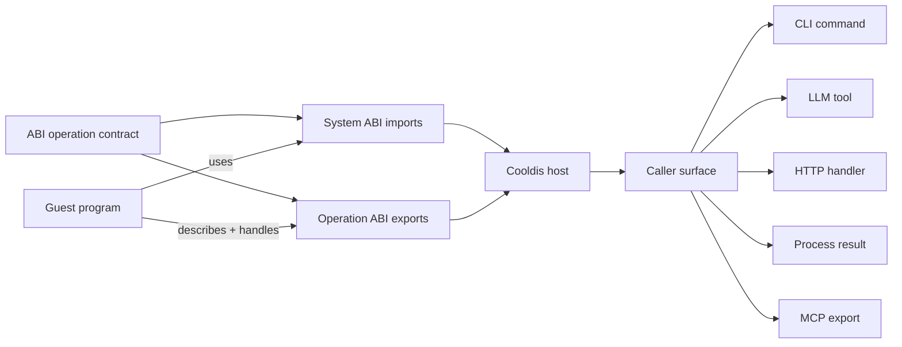
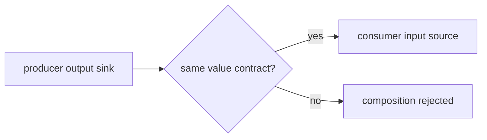

# ABI: Cooldis Operation Boundary

ABI is the unified Cooldis operation boundary. It names both the portable
operation contract and the concrete host/guest mechanics that make the contract
runnable.

Guest programs import explicit host powers through system ABI calls, export
explicit operations through a versioned operation ABI, and Cooldis re-presents
those operations as CLI, HTTP, LLM-tool, harness, frontend, process, or
MCP-shaped surfaces. The surface changes; the operation contract and
authority model do not.



## Core Laws

```text
Every surface is faithful, or it is illegal.
```

A surface can rename syntax, transport, framing, or placement. It cannot add
new powers, hide durable mutation, erase required inputs, or pretend an event is
the operation's final output.

```text
No hidden durable sink.
```

If an operation writes durable state, the ABI must declare an effect port. The
host binds or allocates that effect at invocation time and returns a receipt
that says what happened.

## Glossary

- **ABI operation contract**: the canonical source/sink/effect/event shape of a
  callable operation.
- **System ABI**: placement-specific calls guest code can make to request host
  powers such as HTTP, VFS, cancellation, secrets, or future SQL.
- **Operation ABI**: guest exports for manifest discovery and operation
  invocation.
- **Surface**: a faithful caller-facing re-presentation of the same contract,
  such as CLI, HTTP, LLM tool, MCP, process, virtual bash, or harness.
- **Placement**: where and how the operation runs, such as Wasm, native
  process, bridge worker, remote sandbox, or in-process harness.
- **Source port**: data or an artifact the operation can consume.
- **Sink port**: data or an artifact the operation can produce.
- **Effect port**: a declared durable mutation the operation may commit.
- **Event port**: progress or diagnostic output that is observable but usually
  not compositional data.
- **Receipt**: host-created evidence that a declared effect happened.
- **Caller identity**: the user, agent, scheduler, product API, or system actor
  that requested an invocation.
- **Execution identity**: the principal whose authority the operation actually
  runs under.
- **Attachment identity**: a scoped credential or external-system binding used
  by a specific host import.

## Port Model

V1 maps the existing operation ABI into a tiny ABI operation contract:

```text
input source  -> invocation input bytes/text/json
output sink   -> invocation output bytes/text/json
event port    -> invocation JSONL events, when declared
effect ports  -> declared durable writes, empty for pure operations
```

The Rust types live in `crates/cooldis-kernel/src/capabilities/abi.rs`:

```text
AbiOperationContract
  source_ports: Vec<AbiSourcePort>
  sink_ports: Vec<AbiSinkPort>
  effect_ports: Vec<AbiEffectPort>
  event_ports: Vec<AbiEventPort>
```

Registered Wasm operation manifests map into ABI operation contracts through
`OperationProjection.abi` (the identifier rename is tracked for the cleanup
pass). Later surfaces, such as virtual bash, can check compatibility against
the same contract instead of inventing new rules.

## Layer Model

### 1. System ABI

The system ABI is what the guest can ask the host to do.

Network should come first:

- outbound HTTP requests;
- host-mediated headers and secrets;
- response bodies, status, and headers;
- timeouts, byte limits, cancellation, and event emission;
- deny-by-default destination policy.

Process/POSIX-shaped powers come later:

- argv, env, stdin, stdout, stderr, and exit status;
- scoped virtual filesystem mounts;
- working directory;
- concurrent file claims and writeback policy;
- process tree and cancellation semantics.

Full POSIX is not a V1 goal. The first POSIX slice should be process-shaped,
not Unix-complete.

### 2. Operation ABI

The operation ABI is what the guest exposes to the host.

Current Cooldis Wasm operation shape:

```text
registration:
  __cooldis_describe_module__(manifest_sink) -> status

runtime:
  __cooldis_call_operation__(
    operation_id,
    invocation_handle,
    input_source,
    output_sink,
    event_sink
  ) -> status
```

Custom coupling capsules reuse the Wasm operation call path with versioned JSON
payloads instead of a new entrypoint:

```text
input:  cooldis.coupling.invocation/0.1
output: cooldis.coupling.discharge/0.1
```

The invocation carries the trigger event, selected source event cut, manifest
config, and invocation metadata. The discharge contains proposed events only.
The kernel stamps discharged origin and provenance after validating the declared
sink stream and kind, so guest-supplied provenance is ignored. Coupling capsules
run under the pure-compute host import policy: no HTTP, VFS, secrets, or other
effectful imports are available through this surface.

The manifest should grow from value kinds toward typed schemas:

```json
{
  "abi": "cooldis.operation/0.1",
  "operations": [
    {
      "id": 1,
      "name": "search",
      "input_schema": { "type": "object" },
      "output_schema": { "type": "object" },
      "mode": "sync",
      "required_capabilities": [
        "net.http:api.example.invalid",
        "secret:EXAMPLE_API_KEY"
      ]
    }
  ]
}
```

### 3. Surface

A surface is how a caller sees an operation. The same operation can become:

- `cooldis tool run search --json ...`;
- `cooldis run search invoke` with stdin/stdout/stderr/exit semantics;
- an LLM tool schema;
- an HTTP route;
- a harness fixture;
- an MCP tool export;
- a frontend action.

A surface is not allowed to smuggle new powers into the guest. It only maps
caller input into the ABI input contract and maps operation output/events back
to the caller.

Current registry surface:

```text
OperationRegistration
-> OperationRegistry::register
-> RegisteredOperation
-> OperationProjectionSet
```

The registry validates the operation manifest and required capability grants
before an operation becomes visible, and replacement is atomic: a failed
registration leaves the previous operation installed.

Current surfaces are:

- CLI: `cooldis tool run <registered> <operation>`;
- Process: `cooldis run <registered> <operation>`;
- HTTP: `POST /operations/<registered>/<operation>`;
- LLM tool: a normalized tool name with the same input/output value kinds;
- MCP: a normalized MCP tool name with the same input/output value kinds.

These surfaces are generated from the registered operation. They are not
independent contracts.

## Virtual Bash Surface

Registered operations also expose a process-shaped surface:

```text
cooldis run <registered> <operation>
```

Inside `VirtualBashRuntime`, this is a shell builtin, not a native binary. It
maps:

```text
stdin  -> operation input source
stdout -> operation output sink
stderr -> operation event port
status -> shell exit code
```

That means ordinary shell composition works while still using the ABI contract:

```sh
echo '{"query":"cooldis"}' | cooldis run search search
cooldis run formatter format < /workspace/in.json > /workspace/out.json 2> /workspace/events.jsonl
```

The process surface does not add new filesystem powers. File reads and
writes still go through shell redirection or declared operation effects.

## Composition

A producer can feed a consumer only when the producer sink is compatible with
the consumer source:



For V1, compatibility is intentionally exact for `bytes`, `text`, and `json`.
Schema-aware compatibility can grow later, but the default should stay lawful:
if the host cannot prove the connection preserves the contract, it rejects the
composition.

## Effects

Filesystem writes are not sinks. They are effects.

```text
stdout/output sink     = compositional data
vfs write effect port  = durable mutation
event port             = progress/diagnostics
```

Future VFS write modes should be declared before `fs_write` exists:

- `write_new`;
- `replace`;
- `append`;
- `scratch`;
- caller-bound path;
- host-allocated path;
- operation-selected path within a declared scope.

Every durable write returns an `AbiEffectReceipt` with the effect port name,
path, invocation attribution, and optional size/hash/media metadata.

`fs_write` is illegal until the host can prove all three pieces exist:

```text
declared effect port
-> invocation effect claim
-> host-created effect receipt
```

Binding modes:

- **caller-bound path**: caller supplies the path, optionally constrained by
  the declared port;
- **host-allocated path**: host allocates the durable target, useful for
  scratch/artifact output;
- **operation-selected path**: operation may choose a path inside a declared
  virtual scope.

The current Rust contract includes `AbiEffectClaim` and
`AbiOperationContract::allows_effect_claim` so tests can prove the shape before
the Wasm ABI grows `fs_write`.

## Invocation Identity

Operations do not inherit caller authority by default. The host creates an
`InvocationContext` for each run:

```text
caller              -> who requested the operation
execution           -> what authority the operation runs as
grants              -> host-approved capabilities for this invocation
attachment_bindings -> credential or external-system handles
audit_metadata      -> opaque runtime audit fields
```

The caller and execution principal can intentionally differ. For example, a user
may request a shared Example Search wrapper, while the operation executes as a narrow
`system:http-broker` principal with only `net.http:*` and `secret:EXAMPLE_API_KEY`
grants. A chmod-style provisioner can run as a provisioner principal even when
triggered by an agent.

Wasm guests receive only the opaque `invocation_handle` passed to
`__cooldis_call_operation__`. They do not receive raw tenant, user, session, or
caller identity. Host imports resolve the handle to grants, attachment bindings,
audit metadata, and cancellation state. If a future import exposes identity, it
must be explicit and capability-gated; the default ABI has no `caller_identity`
import.

Attachment bindings are also opaque to the guest. A guest may ask the host to
use a named secret header or future SQL attachment handle, but the host decides
whether the invocation has the matching grant and binding. Missing grants fail
before guest execution when declared in the manifest, or before the privileged
host import performs work.

## Network First

Network is the best first system ABI surface because it proves the Example Search-style
case without waiting on filesystem scoping.

The HTTP design uses a dedicated host import instead of a generic host-call
multiplexer:

- pass request metadata and request body separately;
- treat any received HTTP response status as a successful host call;
- reserve host-call errors for transport, policy, timeout, decode, or execution
  failures where no usable HTTP response was produced;
- sanitize host error messages so query strings, headers, and secret material do
  not leak into guest logs or caller-visible errors;
- block private and special-purpose network destinations by default;
- avoid blocking host calls while holding future mutable attachment claims.

Capability grants are denied unless the operation manifest and host grant agree:

```text
net.http:<origin>
net.http:GET:<origin>
net.http:POST:<origin>
net.http:<METHOD>:<origin-pattern-with-*>
secret:<name>
```

Example:

```text
net.http:POST:https://api.example.invalid
net.http:GET:https://*
secret:EXAMPLE_API_KEY
```

For V1, keep the ABI byte-oriented and put HTTP metadata in a versioned JSON
envelope. The request body is a separate byte slice/source, not base64 inside
the metadata.

```json
{
  "abi": "cooldis.net.http/0.1",
  "method": "POST",
  "url": "https://api.example.invalid/search",
  "headers": [
    ["content-type", "application/json"]
  ],
  "secret_headers": [
    ["x-api-key", "EXAMPLE_API_KEY"]
  ],
  "timeout_ms": 10000,
  "max_response_bytes": 1048576
}
```

The guest names secrets; the host resolves them. The guest does not receive a
raw secret unless the operation output explicitly includes it, which host policy
should reject for normal tool calls.

The response metadata is also JSON. The response body is a separate byte sink.
HTTP status codes such as 404 and 500 still produce an `ok` host-call status;
the operation can decide how to interpret the response.

```json
{
  "abi": "cooldis.net.http/0.1",
  "status": 200,
  "headers": [
    ["content-type", "application/json"]
  ],
  "truncated": false,
  "elapsed_ms": 183
}
```

The host import shape stays explicit:

```text
cooldis_0.1.http_request(
  invocation_handle,
  request_ptr,
  request_len,
  body_ptr,
  body_len,
  out_ptr,
  event_sink
) -> status
```

If `body_len` is zero, the host ignores `body_ptr`. On success, `out_ptr` points
to two little-endian `u32` handles: response metadata source and response body
source. The guest reads them with `source_read`, matching the existing
source/sink shape.

## OpenAPI Adapter

OpenAPI is an adapter ingress format, not the runtime contract. The adapter
normalizes REST operations into ABI operation plans, renders small HTTP wrapper
artifacts, validates them through the same registration path, and then lets the
registry surface them as CLI, HTTP, LLM tools, harness calls, or MCP exports.

See [OpenAPI To ABI Operation Adapter](openapi-adapter.md) for the publish
contract, auth mapping, and V1 rejects.

## POSIX Later

POSIX-shaped execution needs a separate design pass because the hard questions
are not just syscall names:

- which filesystem roots are mounted;
- whether paths are stable across local/cloud handoff;
- who can claim a file for concurrent read/write;
- what happens when a long-running operation writes while another reads;
- whether stdout is final output, event stream, or both;
- how cancellation maps to process trees;
- whether native and Wasm runners share identical semantics.

The V1 ABI decision is:

```text
Network first.
Process shape second.
Full POSIX never by default.
```

That leaves room for real Unix compatibility later without letting it leak into
the first network/tool interface.

Process, VFS, and claim semantics remain separate design work. The public V1
contract keeps the network/tool ABI first and treats POSIX-shaped execution as a
later compatibility layer.

## Encoding Trajectory

The V1 guest encoding is core Wasm with JSON over linear memory. The
WebAssembly component model (WIT) is the named successor, and the migration is
planned, not pending discovery: the SDK macro layer is the compatibility
boundary, the wire encoding is a private detail of the macro expansion, and
the component migration swaps the expansion and the host executor without
touching guest source, manifests, or recorded operation contracts.

See [ADR 0002](adr/0002-guest-encoding-v1-component-model-later.md) for the
decision, the reasons components are not V1, and the migration triggers.
