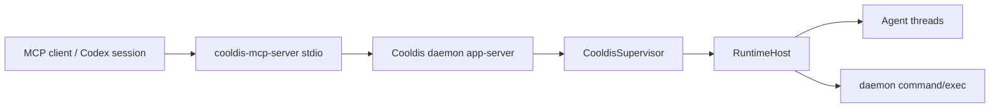

# Cooldis MCP Server

`cooldis-mcp-server` exposes a small MCP stdio server that lets MCP clients
orchestrate the Cooldis daemon. It is a projection over the daemon/app-server
control plane, not a second runtime scheduler.

> Directionality tip: run this server when another MCP client should use
> Cooldis. If Cooldis should use someone else's MCP server, register that server
> as a tool source with `cooldis tool source add ...`.



## Running

Start a Cooldis daemon or app-server on a Unix socket:

```sh
cargo run --bin cooldis -- rpc --listen unix:///tmp/cooldis.sock
```

For model-backed orchestration, run the daemon with a provider config. An
OpenAI Chat Completions-compatible daemon looks like:

```toml
[daemon.app_server]
listen = "unix:///tmp/cooldis.sock"

[daemon.provider]
provider = "openai_chat_completions"
base_url = "https://api.openai.com"
api_key_env = "OPENAI_API_KEY"
model = "gpt-4.1-mini"
stream = false
max_tokens = 4096
```

Start the MCP server against that socket:

```sh
cargo run --bin cooldis-mcp-server -- --listen unix:///tmp/cooldis.sock
```

The server reads MCP JSON-RPC messages from stdin and writes MCP JSON-RPC
messages to stdout. Logs and diagnostics must go to stderr.

You can also pass a raw socket path:

```sh
cargo run --bin cooldis-mcp-server -- --socket /tmp/cooldis.sock
```

Environment defaults are supported:

```sh
COOLDIS_DAEMON_LISTEN=unix:///tmp/cooldis.sock cooldis-mcp-server
COOLDIS_DAEMON_SOCKET=/tmp/cooldis.sock cooldis-mcp-server
```

Command-line flags override environment variables.

## Codex Config Shape

For source-tree development, `cargo run --quiet` works, though the first
compile may emit progress on stderr:

```toml
[mcp_servers.cooldis]
command = "cargo"
args = [
  "run",
  "--quiet",
  "--bin",
  "cooldis-mcp-server",
  "--",
  "--listen",
  "unix:///tmp/cooldis.sock",
]
```

## Tools

- `cooldis_daemon_status`: connect to the configured daemon socket and return
  basic model/status data.
- `cooldis_thread_start`: start a supervised daemon thread. By default this
  starts a root thread; callers can pass `parentThreadId` for the common spawned
  child case or `topology` for the full Cooldis thread topology contract.
  Optional `model` and `modelProvider` fields must select exactly one profile
  declared by the bound manifest; they do not synthesize a new model envelope.
- `cooldis_thread_list`: list daemon-known threads.
- `cooldis_thread_read`: read a thread, optionally including turns.
- `cooldis_turn_start`: submit a user message to a thread, optionally waiting
  for completion.
- `cooldis_turn_wait`: wait for a turn created on this MCP connection.
- `cooldis_turn_interrupt`: interrupt a running turn.
- `cooldis_prompt`: start a thread, submit one message, wait, and return
  assistant text.
- `cooldis_command_exec`: call the daemon's existing `command/exec` path and
  return exit code, stdout, and stderr.
- `cooldis_capsule_binding_set`: bind a published capsule operation to global,
  tenant, or thread scope.
- `cooldis_capsule_binding_delete`: remove or tombstone a capsule operation
  binding for a scope.
- `cooldis_capsule_binding_list`: list capsule operation bindings for a scope.
- `cooldis_capsule_binding_resolve`: resolve the effective capsule operation
  binding snapshot for a tenant or thread.

## Thread Topology

`topology` is the canonical Cooldis runtime shape. The MCP server forwards it to
the daemon control plane and thread read/list responses include the recorded
topology. For the common child-thread case, `parentThreadId` is an alias for a
`ThreadTopology::spawned_from(parent)`.

Example child start:

```json
{
  "parentThreadId": "019e85e0-0944-7cb1-989f-9b15b2bed1c7"
}
```

Example full topology:

```json
{
  "topology": {
    "initiation": {
      "type": "thread",
      "thread_id": "019e85e0-0944-7cb1-989f-9b15b2bed1c7"
    },
    "lineage": {
      "type": "root"
    },
    "spawn_attribution": {
      "source_thread_id": "019e85e0-0944-7cb1-989f-9b15b2bed1c7"
    },
    "controller_thread_id": "019e85e0-0944-7cb1-989f-9b15b2bed1c7"
  }
}
```

Send either `topology` or `parentThreadId`, not both. `cooldis_thread_start`
and `cooldis_prompt.thread` may pass `cwd`, which lowers to the manifest
runtime override `defaultCwd`. Non-empty `capsuleBindings.operationNames` is
rejected: operations must be declared in the bound manifest.

## Capsule Bindings

The MCP capsule binding tools are direct projections over app-server methods:

```json
{
  "scope": { "kind": "global" },
  "operationName": "search"
}
```

`cooldis_capsule_binding_set` defaults `artifactHash` to the published
operation's active record. Binding resolution still happens in the app-server at
thread start, so the MCP server is only an ingress surface; it is not a separate
capsule registry.

## V1 Limits

- The server connects lazily, so `initialize` and `tools/list` work before the
  daemon socket is available. Tool calls that need the daemon return an MCP tool
  error if the daemon cannot be reached.
- Turn waiting is connection-local in V1. `cooldis_turn_wait` is intended for
  turns submitted through the same MCP server process because it consumes live
  daemon notifications from that WebSocket connection.
- `cooldis_command_exec` uses the existing daemon `command/exec` method. It is
  not yet the newer process-handle API over virtual/host/remote/libkrun routing.
- ABI operations as dynamic MCP tools are a later layer. Capsule binding
  management is projected through fixed MCP tools, while operation invocation
  remains model-visible through the app-server tool/bash surfaces.

## Verification

Focused MCP coverage:

```sh
cargo test mcp_server
```

Full runtime verification:

```sh
scripts/verify.sh
```
