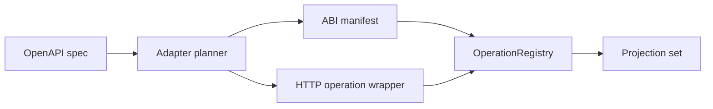

# OpenAPI To ABI Operation Adapter

Status: V1 implemented.

This adapter turns ordinary REST API descriptions into Verlet operations. The
goal is not to make OpenAPI the kernel contract. OpenAPI is an ingress format;
ABI remains the runtime contract.

## Shape

```text
OpenAPI document
-> normalize servers, paths, methods, auth, schemas
-> select operations
-> generate ABI operation manifest
-> generate or bind a small HTTP guest wrapper
-> register artifact in OperationRegistry
-> project as CLI / HTTP / LLM tool / MCP
```



V1 emits operation artifacts that call `cooldis_0.1.http_request`. Later
implementations can generate Rust guests that use `verlet-guest-sdk`, but the
adapter contract does not depend on Rust.

## Authoring Package

`verlet import build|publish --package <path>` accepts `verlet.import.toml`
from a directory or an explicit `<name>.import.toml` file. The package names a
vendored local JSON document and its sha256, optional API-key or bearer secret
wiring, and the selected operations:

```toml
[import]
name = "catalog"
version = "1.0.0"

[spec]
path = "openapi.json"
sha256 = "0123456789abcdef0123456789abcdef0123456789abcdef0123456789abcdef"

[auth]
scheme = "apiKey"
header = "x-api-key"
secret = "CATALOG_API_KEY"

[[operations]]
operation_id = "search"
alias = "catalog_search"
```

V1 requires exactly one OpenAPI server. `[auth]` is the credential-binding
authority: `apiKey` uses the declared header, while `bearer` requires
`Authorization` and adds the `Bearer ` prefix. Basic, OAuth2, and OpenID Connect
are rejected before artifact generation.

## Mapping

OpenAPI operation selection:

- Prefer `operationId` for the ABI operation name.
- Fall back to `<method>_<path>` with path parameters normalized to stable
  snake-case names.
- Reject duplicate projected names until the caller supplies explicit aliases.
- Preserve source spec metadata as opaque operation metadata.

Request mapping:

- Path parameters become URL interpolation inputs.
- Query parameters become URL query entries.
- Header parameters become explicit header inputs unless they are credentials.
- JSON request bodies map to `input: "json"` in V1.
- The pinned input schema is enforced again at the HTTP host boundary; optional
  body-only operations use an optional top-level `body` field so omission is
  representable.
- Unsupported bodies, multipart uploads, binary streams, callbacks, and
  bidirectional sockets are rejected in V1.

Response mapping:

- Any HTTP status returned by the upstream service is an operation output, not a
  host-call failure.
- The wrapper should include response status, headers, body, and truncation in a
  stable JSON result shape unless the selected operation declares a narrower
  projection.
- Host-call failures remain reserved for policy, transport, timeout, decode, or
  cancellation errors.

Capability mapping:

```text
servers[].url + method -> net.http:<METHOD>:<origin>
apiKey header auth    -> secret:<name> + secret_headers
bearer auth           -> secret:<name> + Authorization header
basic auth            -> secret:<name> or rejected until credential pairing exists
oauth2/openIdConnect  -> rejected until invocation identity delegation lands
```

Loopback and private origins use the existing
`net.http.private:<METHOD>:<origin>` grant required by the HTTP host policy.

The adapter must require both manifest declaration and registry grant binding
before publish succeeds.

## Publish Contract

Publish should follow the same discipline as direct Wasm operation registration:

```text
load spec
-> produce candidate operation plan
-> render artifact
-> describe artifact
-> validate operation ABI
-> validate required capabilities are bound
-> register atomically
```

No partially generated operation should become visible. Replacing an existing
OpenAPI-backed operation should use the same atomic replacement behavior as
`OperationRegistry::register`.

## V1 Artifact Rendering

The publisher encodes a small deterministic Wasm module directly, without
running Cargo, rustc, an SDK generator, or a WAT compiler. The module data
segments contain the ABI manifest and one normalized HTTP request plan per
operation. Each request plan pins the server URL, path template, parameter
mapping, auth header names, request-body schema, response mode, and required
capabilities under the artifact hash.

At invocation, the generated guest reads the JSON input and passes it with the
pinned plan to `cooldis_0.1.http_request`. The HTTP host import interpolates path
parameters, appends query parameters, adds explicit and secret-backed headers,
selects the JSON body, and returns the stable `{status, headers, body,
truncated}` envelope. Valid JSON response bodies remain JSON values; other
response bytes become a UTF-8 string. Repeated response-header names collapse to
one object entry. Response reads are bounded by the pinned byte limit, and
envelope encoding may shorten the body further to keep the operation output
valid JSON within that limit. Any upstream HTTP status, including 500, remains
successful operation output; policy, transport, timeout, decode, cancellation,
and response-limit failures remain host-call failures.

The runtime never parses OpenAPI. It sees an ordinary Wasm operation artifact
and a normalized HTTP request envelope, and publication still passes through
`LocalOperationRegistry::publish_artifact`.

## V1 Non-Goals

- OAuth browser flows.
- User-delegated credential exchange.
- Webhooks, SSE, WebSockets, or OpenAPI callbacks.
- Multipart file upload.
- Arbitrary client SDK generation.
- Product-specific auth, billing, or dashboard fields in core runtime types.

## V1 Verification

- operationId maps to ABI operation name;
- duplicate operationIds are rejected;
- API-key header auth becomes `secret_headers`;
- missing `net.http` or `secret` grants reject publish;
- mock Example Search-style OpenAPI spec generates a callable operation;
- HTTP 500 from upstream returns an operation output, not a failed host call;
- unsupported OAuth/callback/multipart shapes return typed adapter errors.
