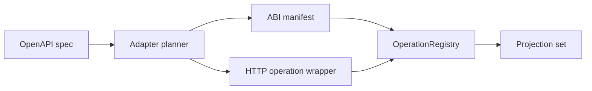

# OpenAPI To ABI Operation Adapter

This is the plan for turning ordinary REST API descriptions into Cooldis
operations. The goal is not to make OpenAPI the kernel contract. OpenAPI is an
ingress format; ABI remains the runtime contract.

## Shape

```text
OpenAPI document
-> normalize servers, paths, methods, auth, schemas
-> select operations
-> generate ABI operation manifest
-> generate or bind a small HTTP guest wrapper
-> register artifact in OperationRegistry
-> project as CLI / HTTP / LLM tool / MCP
```



The first implementation should emit operation artifacts that call
`cooldis_0.1.http_request`. Later implementations can generate Rust guests that
use `cooldis-guest-sdk`, but the adapter contract should not depend on Rust.

## Mapping

OpenAPI operation selection:

- Prefer `operationId` for the ABI operation name.
- Fall back to `<method>_<path>` with path parameters normalized to stable
  snake-case names.
- Reject duplicate projected names until the caller supplies explicit aliases.
- Preserve source spec metadata as opaque operation metadata.

Request mapping:

- Path parameters become URL interpolation inputs.
- Query parameters become URL query entries.
- Header parameters become explicit header inputs unless they are credentials.
- JSON request bodies map to `input: "json"` in V1.
- Unsupported bodies, multipart uploads, binary streams, callbacks, and
  bidirectional sockets are rejected in V1.

Response mapping:

- Any HTTP status returned by the upstream service is an operation output, not a
  host-call failure.
- The wrapper should include response status, headers, body, and truncation in a
  stable JSON result shape unless the selected operation declares a narrower
  projection.
- Host-call failures remain reserved for policy, transport, timeout, decode, or
  cancellation errors.

Capability mapping:

```text
servers[].url + method -> net.http:<METHOD>:<origin>
apiKey header auth    -> secret:<name> + secret_headers
bearer auth           -> secret:<name> + Authorization header
basic auth            -> secret:<name> or rejected until credential pairing exists
oauth2/openIdConnect  -> rejected until invocation identity delegation lands
```

The adapter must require both manifest declaration and registry grant binding
before publish succeeds.

## Publish Contract

Publish should follow the same discipline as direct Wasm operation registration:

```text
load spec
-> produce candidate operation plan
-> render artifact
-> describe artifact
-> validate operation ABI
-> validate required capabilities are bound
-> register atomically
```

No partially generated operation should become visible. Replacing an existing
OpenAPI-backed operation should use the same atomic replacement behavior as
`OperationRegistry::register`.

## V1 Non-Goals

- OAuth browser flows.
- User-delegated credential exchange.
- Webhooks, SSE, WebSockets, or OpenAPI callbacks.
- Multipart file upload.
- Arbitrary client SDK generation.
- Product-specific auth, billing, or dashboard fields in core runtime types.

## Tests To Add With Implementation

- operationId maps to ABI operation name;
- duplicate operationIds are rejected;
- API-key header auth becomes `secret_headers`;
- missing `net.http` or `secret` grants reject publish;
- mock Example Search-style OpenAPI spec generates a callable operation;
- HTTP 500 from upstream returns an operation output, not a failed host call;
- unsupported OAuth/callback/multipart shapes return typed adapter errors.
