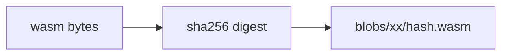
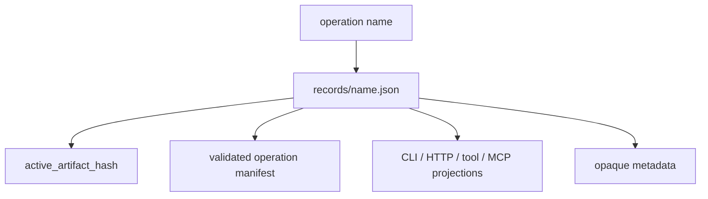
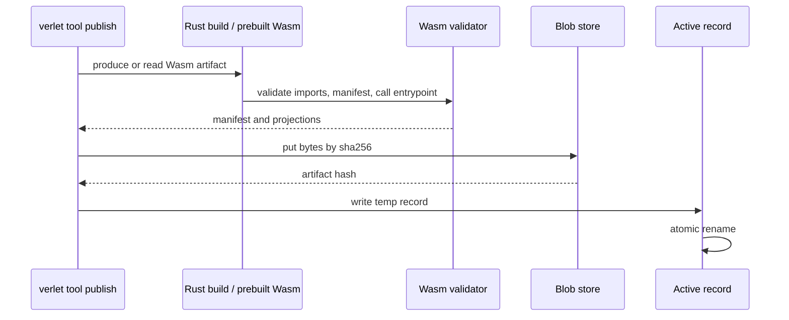
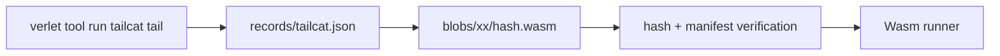

# Tool Publish Storage

Verlet steals the publish invariant from SpacetimeDB without stealing the
database coupling.

SpacetimeDB stores module bytes as content-addressed program blobs, validates a
module before it becomes visible, and treats the active module pointer as the
commit point. That is the useful part for Verlet. The database-shaped parts,
such as reducers, schema tables, and embedding current program bytes in DB
state, stay out of the runtime core.

## Local V1 Shape

The local operation registry lives at `.verlet/operations` under the daemon or
app-server runtime `cwd` by default. Daemon TOML may override that root with
`daemon.registries.operations`; if the conventional default root is absent, the
runtime treats it as an empty registry until records are published. The registry
has these durable shapes:

```text
.verlet/operations/
  blobs/
    ab/
      abcd...1234.wasm
  records/
    tailcat.json
  versions/
    tailcat/
      abcd...1234.json
  bindings/
    global/
      tailcat.json
    tenant/<tenant-id>/
      tailcat.json
    thread/<tenant-id>/<thread-id>/
      tailcat.json
```

`verlet tool list --registry-root <path>` lists the active published operation
records in that registry. The `ACTIVE HASH` column is the full
`active_artifact_hash` value used in `op://...@sha256:<hash>` manifest refs.

The blob is immutable and content-addressed:



The published operation record in `records/` is the mutable active pointer:



Publishing installs the blob first, then writes the record through a temp file
and atomic rename:



Publishing also writes an immutable version record under
`versions/<name>/<hash>.json` before moving the active pointer. The final active
record rename is the publish commit point. If validation fails, blob write fails,
or record encoding fails, the previous active record remains the published
operation.

Binding records are the hot-swappable layer above published versions. They pin a
published operation name to a version hash, or write a tombstone that removes an
inherited binding for a narrower scope:

```text
global binding:              tailcat -> abcd...1234
tenant binding:              tailcat -> abcd...1234
thread binding tombstone:    tailcat -> tombstone
```

Resolution walks global, tenant, then thread scope. Version bindings replace an
earlier record with the same name; tombstones remove the inherited record. The
app-server methods `capsule/binding/set`, `capsule/binding/delete`,
`capsule/binding/list`, and `capsule/binding/resolve` are projections over this
same registry state.

## Run Path

Registry-backed run resolves the active record every time:



The runner refuses to execute if:

- the active blob is missing;
- the blob bytes no longer hash to the record pointer;
- the artifact manifest does not match the stored manifest;
- the operation name is not in the manifest.

This keeps local publish repeatable now and leaves room for a remote control
plane later. A future registry can replace the local `records/` directory with a
service or durable attachment engine without changing the operation ABI.

## Agent Publish Verification

Agent manifests pin operations with `op://<record>@sha256:<hash>` or
`op://<record>/<operation>@sha256:<hash>`. `verlet agent publish` verifies
those rows against the local operation registry before writing the agent record.
The operations registry root defaults to `.verlet/operations`; pass
`--operations-registry-root <path>` when publishing against another registry.

Publish rejects an `op://` tool row when:

- the operation registry root is missing;
- `records/<record>.json` is absent or invalid;
- `versions/<record>/<hash>.json` is absent or does not match the hash;
- a two-segment ref names an operation not declared by that version record.

`verlet agent plan` remains an offline dry run: when an operations registry is
present it performs the same verification and prints `[verified]`; when the
registry is absent it succeeds and prints `[unverified-offline]` for `op://`
rows.

## Local Plugin Path

The local plugin catalog is the agent-facing layer above this registry. It loads
published records, verifies the active blob and manifest, attaches configured VFS
mounts, and registers the operation artifacts into an in-memory
`OperationRegistry` for the agent loop.

When an app-server has capsule bindings configured, default-manifest synthesis
lowers configured active records into pinned manifest tool rows. Durable binding
methods still resolve binding snapshots for management flows, but thread
runtime authority comes from recorded `binding.attached` events, as changed by
later `binding.detached`/`binding.attached` events. Folding that history yields
the active toolset; the manifest and `manifest.bind.completed` receipt retain
their preset and provenance roles.

The path-3 development loop is:

```text
Rust source -> verlet tool publish -> LocalPluginCatalog
  -> AgentLoopFactory::with_operation_registry(...)
  -> agent-visible LLM tool -> Wasm operation with shared plugin VFS
```

For trusted local runs, plugin mounts can use `HostFileSystem` to expose a live
host directory under a virtual path such as `/workspace`. Remote and
multi-tenant runs should provide their own mount backend around the same VFS
boundary instead of relying on local host paths.

## Non-Goals

V1 publish storage does not:

- persist tenant/product ledgers;
- embed Wasm bytes into a database system table;
- manage distributed leases or multi-location consistency;
- implement durable resume/fork for operation state.

Those belong to product ledgers, orchestration layers, or later attachment
engines around Verlet.
